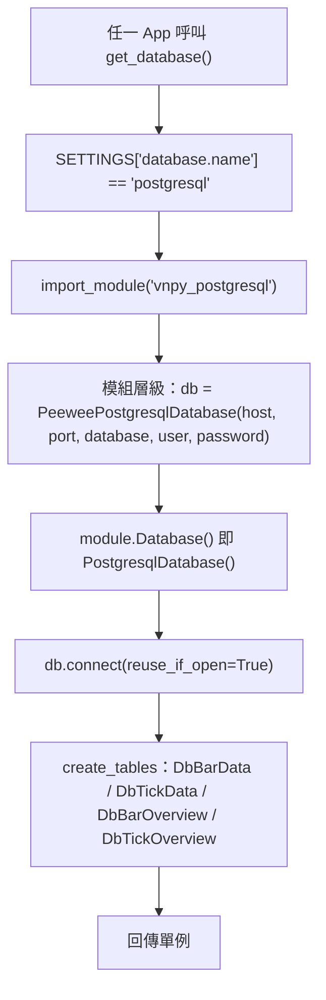
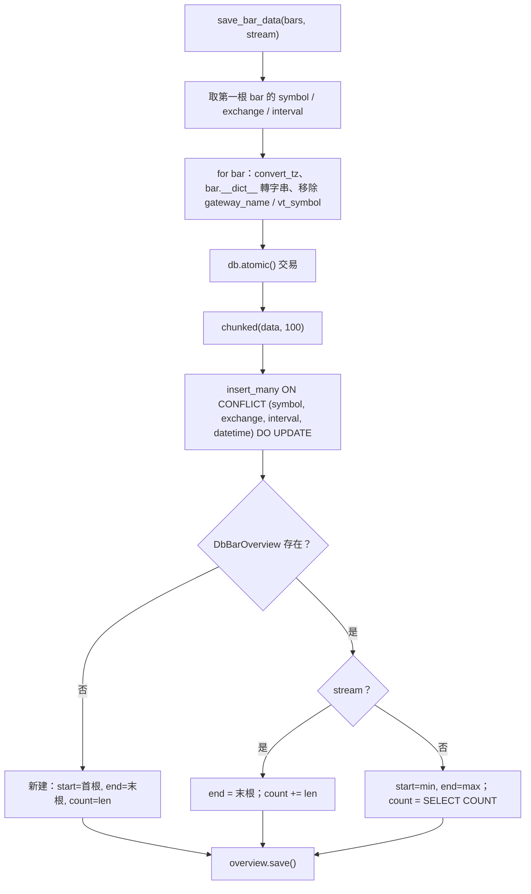
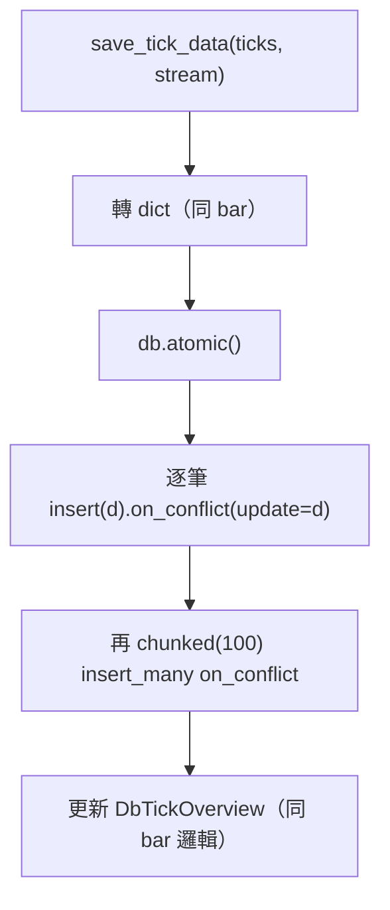
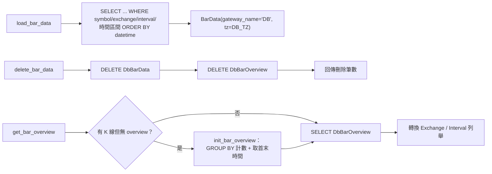

# vnpy_postgresql 流程圖

> 對應分析：[ANALYSIS.md](./ANALYSIS.md)

## 1. 載入與初始化

```mermaid
flowchart TD
    A["任一 App 呼叫 get_database()"] --> B["SETTINGS['database.name'] == 'postgresql'"]
    B --> C["import_module('vnpy_postgresql')"]
    C --> D["模組層級：db = PeeweePostgresqlDatabase(host, port, database, user, password)"]
    D --> E["module.Database() 即 PostgresqlDatabase()"]
    E --> F["db.connect(reuse_if_open=True)"]
    F --> G["create_tables：DbBarData / DbTickData / DbBarOverview / DbTickOverview"]
    G --> H["回傳單例"]
```

## 2. save_bar_data

```mermaid
flowchart TD
    A["save_bar_data(bars, stream)"] --> B["取第一根 bar 的 symbol / exchange / interval"]
    B --> C["for bar：convert_tz、bar.__dict__ 轉字串、移除 gateway_name / vt_symbol"]
    C --> D["db.atomic() 交易"]
    D --> E["chunked(data, 100)"]
    E --> F["insert_many ON CONFLICT (symbol, exchange, interval, datetime) DO UPDATE"]
    F --> G{"DbBarOverview 存在？"}
    G -- 否 --> H["新建：start=首根, end=末根, count=len"]
    G -- 是 --> I{"stream？"}
    I -- 是 --> J["end = 末根；count += len"]
    I -- 否 --> K["start=min, end=max；count = SELECT COUNT"]
    H --> L["overview.save()"]
    J --> L
    K --> L
```

## 3. save_tick_data

```mermaid
flowchart TD
    A["save_tick_data(ticks, stream)"] --> B["轉 dict（同 bar）"]
    B --> C["db.atomic()"]
    C --> D["逐筆 insert(d).on_conflict(update=d)"]
    D --> E["再 chunked(100) insert_many on_conflict"]
    E --> F["更新 DbTickOverview（同 bar 邏輯）"]
```

## 4. 查詢 / 刪除 / 匯總

```mermaid
flowchart LR
    L1["load_bar_data"] --> Q1["SELECT ... WHERE symbol/exchange/interval/時間區間 ORDER BY datetime"] --> R1["BarData(gateway_name='DB', tz=DB_TZ)"]
    D1["delete_bar_data"] --> Q2["DELETE DbBarData"] --> Q3["DELETE DbBarOverview"] --> R2["回傳刪除筆數"]
    O1["get_bar_overview"] --> C1{"有 K 線但無 overview？"}
    C1 -- 是 --> I1["init_bar_overview：GROUP BY 計數 + 取首末時間"]
    C1 -- 否 --> S1["SELECT DbBarOverview"]
    I1 --> S1
    S1 --> R3["轉換 Exchange / Interval 列舉"]
```
